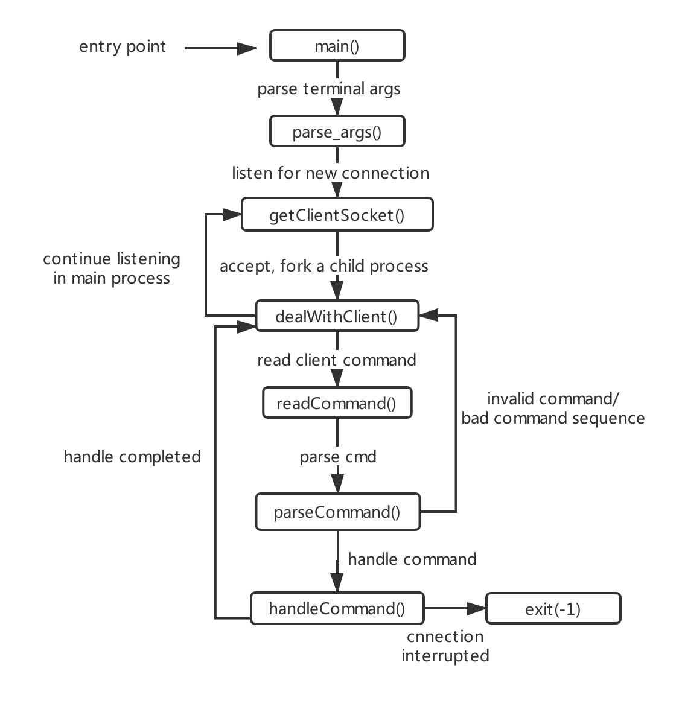
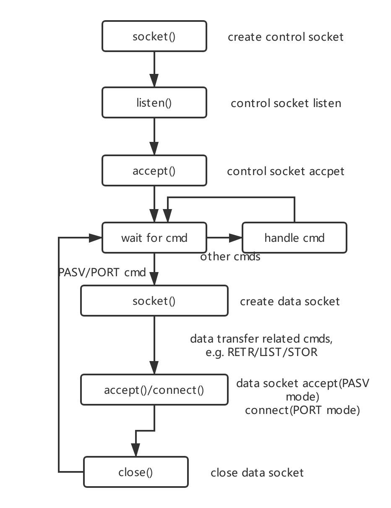

# ftp 实验报告文档

### 项目流程

本次实验实现了一个 linux 系统上的 ftp 服务器，支持 ftp 常用命令、多用户同时登录及文件数据传输等。

服务器主要运行流程如下：

### 数据结构

项目所用主要数据结构为： struct Session

每一个 Session 结构体对应一个客户端，结构体中包含了该客户的相关信息如用户名，密码，控制连接、数据连接的套接字，用户当前发送的命令等。具体定义见 server/src/data_struct.h

服务器端有一个 Session 结构体的链表，其中保存了当前与服务器相连的所有客户端的 Session

### 项目结构

server/src 中的文件夹包含的源代码文件如下：

- data_struct.h

  包含项目所有数据结构/常量的声明

- data_struct.c

  主要包含 Session 链表操作的相关函数定义

- handle_client.h

  包含与客户端进行通信的所有函数的声明

- handle_client.c

  包含与客户端进行通信的所有函数的定义

- init_socket.h

  服务器初始化监听套接字的函数声明

- init_socket.c

  服务器初始化监听套接字的函数定义

- itrpt_handle.h

  信号处理（如服务器被 ctrl+c 中断、内部段错误等）函数的声明

- itrpt_handle.c

  信号处理（如服务器被 ctrl+c 中断、内部段错误等）函数的定义

- parse_cmd.h

  解析用户命令有关函数的声明

- parse_cmd.c

  解析用户命令有关函数的定义

### 实现命令

服务器实现的所有命令如下：

USER, PASS, PASV, PORT, RETR, STOR, MKD, PWD, CWD, RMD

REST, SYST, TYPE, CDUP, LIST, RNFR, RNTO, DELE, QUIT, ABOR

具体实现均符合实验说明文档／RFC 959 要求

### 问题与解决

- 数据连接的建立

  标准 ftp 服务器与客户端的通信是建立在控制连接与数据连接的基础之上的。

  我在实现 RETR 等与数据传输有关的命令时，起初并没有理解这两个连接的建立过程，导致开发进度一度遇到瓶颈。
  后来经过查阅 RFC 文档等资料后，总结在代码中这两个连接的建立过程如下：
  

### 收获与感想

- 熟悉了 ftp 服务器的服务流程及大多数 ftp 命令

- 熟悉并掌握了 c 语言和 python 基于 socket 通信的网络编程

- 熟悉了利用 wxPython 进行 GUI 开发的技术

- 巩固了 c 语言代码结构设计、指针操作、内存管理、文件读取、bug 调试等知识和能力

本次实验开发时间较长，代码量较大，但是回顾起来难点主要还是在于理解 ftp 原理。
经过此次实验我发现了自己许多问题，如对 c 语言指针操作不熟练等，同时也解决了很多问题。
总之，此次实验是一次很好的编程锻炼。
